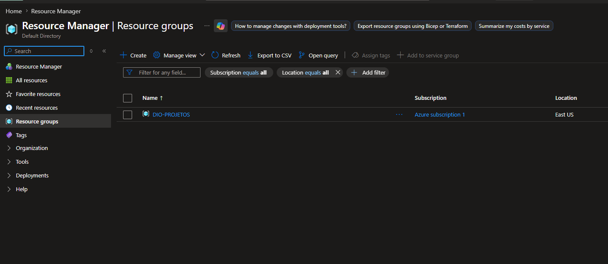
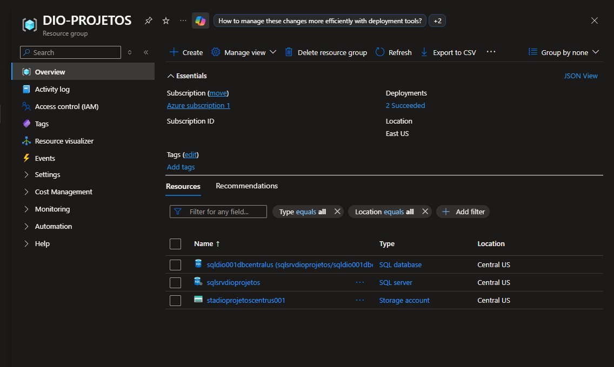
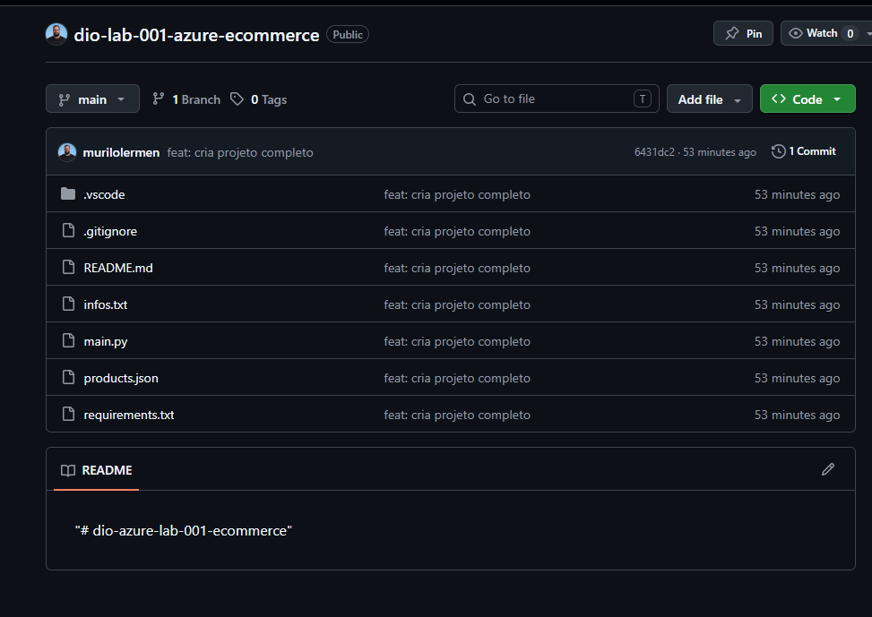
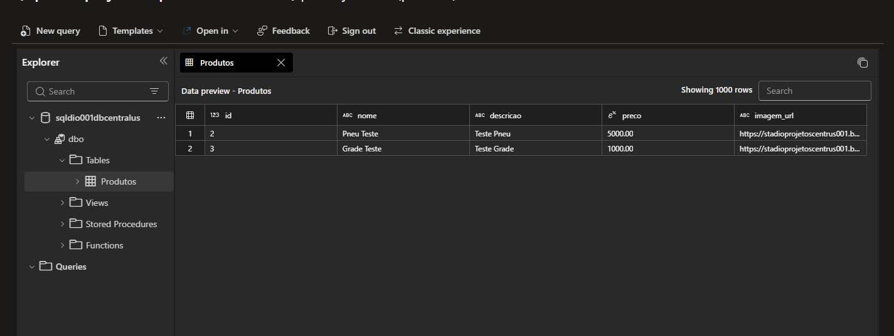
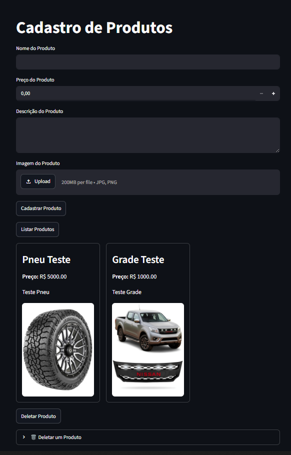
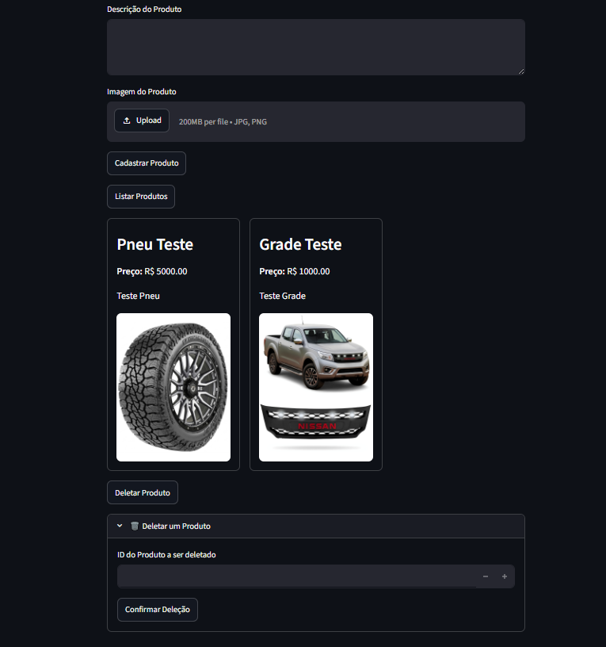

# 🛒 Armazenando Dados de um E-Commerce na Cloud

Projeto desenvolvido como parte do desafio **"Armazenando dados de um E-Commerce na Cloud"** do bootcamp **Microsoft Azure Cloud Native 2026** da [DIO](https://www.dio.me/).

O objetivo é construir uma aplicação de cadastro de produtos de um e-commerce que utiliza serviços gerenciados do **Microsoft Azure** para persistir dados estruturados (banco de dados) e arquivos não estruturados (imagens), tudo orquestrado por uma interface web simples feita em **Streamlit**.

---

## 📋 Sobre o desafio

A proposta consiste em provisionar e integrar recursos do Azure para dar suporte a um e-commerce:

- **Banco de dados relacional** para armazenar as informações dos produtos (nome, preço, descrição).
- **Armazenamento de objetos** para guardar as imagens dos produtos.
- **Aplicação web** que conecta os dois serviços, permitindo cadastrar, listar e excluir produtos.

---

## 🏗️ Arquitetura da solução

```
┌─────────────────┐        ┌──────────────────────────┐
│                 │        │   Azure SQL Database     │
│   Aplicação     │ ─────► │   (dados dos produtos)   │
│   Streamlit     │        └──────────────────────────┘
│   (main.py)     │
│                 │        ┌──────────────────────────┐
│                 │ ─────► │  Azure Blob Storage      │
└─────────────────┘        │  (imagens dos produtos)  │
                           └──────────────────────────┘
```

A aplicação envia a **imagem** do produto para o **Azure Blob Storage** e salva a **URL pública** gerada, junto com os demais dados, no **Azure SQL Database**.

---

## 🛠️ Tecnologias e recursos utilizados

| Categoria        | Tecnologia / Serviço                         |
| ---------------- | -------------------------------------------- |
| Cloud            | Microsoft Azure                              |
| Banco de dados   | Azure SQL Database                           |
| Armazenamento    | Azure Blob Storage (Storage Account)         |
| Linguagem        | Python                                       |
| Interface (UI)   | Streamlit                                    |
| Acesso ao banco  | pymssql                                      |
| Acesso ao blob   | azure-storage-blob                           |
| Variáveis seguras| python-dotenv (`.env` local)                 |

As dependências estão listadas no arquivo [`requirements.txt`](./requirements.txt).

---

## ☁️ Passo a passo da construção

### 1. Criação do Resource Group

Primeiro foi criado o grupo de recursos **`DIO-PROJETOS`** na região **East US**, que agrupa todos os recursos do projeto e facilita o gerenciamento e a exclusão em conjunto.



### 2. Provisionamento dos recursos (Database, Server e Storage Account)

Dentro do grupo `DIO-PROJETOS` foram criados o **SQL Server**, o **SQL Database** e a **Storage Account** (região **Central US**), seguindo um **padrão de nomenclatura** para identificar facilmente o tipo de recurso, o projeto e a região:

| Recurso         | Nome                       | Padrão (tipo + projeto + região/sequência)        |
| --------------- | -------------------------- | ------------------------------------------------- |
| SQL Server      | `sqlsrvdioprojetos`        | `sql` + `srv` (server) + `dioprojetos`            |
| SQL Database    | `sqldio001dbcentralus`     | `sql` + `dio` + `001` + `db` + `centralus`        |
| Storage Account | `stadioprojetoscentrus001` | `st` (storage) + `dioprojetos` + `centrus` + `001`|

> 💡 A padronização de nomes (prefixo do tipo de recurso + projeto + região + número sequencial) é uma boa prática recomendada pela Microsoft para manter a organização e a governança dos recursos.



### 3. Estrutura do repositório e dependências

A estrutura do projeto no GitHub e as bibliotecas utilizadas no Python:



```
dio-lab-001-azure-ecommerce/
├── .vscode/            # Configurações do editor
├── .gitignore          # Arquivos ignorados pelo Git (inclui o .env)
├── README.md           # Este arquivo
├── infos.txt           # Script SQL de criação da tabela Produtos
├── main.py             # Aplicação Streamlit (cadastro, listagem e exclusão)
├── products.json       # Dados de exemplo de produtos
└── requirements.txt    # Dependências do projeto
```

> 🔐 **Segurança:** todas as chaves e strings de conexão (Blob Storage e SQL Server) ficam em um arquivo **`.env` local**, que **não é versionado** (está no `.gitignore`). O código lê essas variáveis com `python-dotenv`.

### 4. Criação da tabela de produtos

A tabela `Produtos` foi criada conforme o script em [`infos.txt`](./infos.txt):

```sql
CREATE TABLE Produtos (
    id INT IDENTITY(1,1) PRIMARY KEY,
    nome NVARCHAR(255),
    descricao NVARCHAR(MAX),
    preco DECIMAL(18,2),
    imagem_url NVARCHAR(2083)
)
```

Após o cadastro de alguns produtos de teste, os dados ficam persistidos no banco. Note a coluna `imagem_url`, que armazena o link da imagem hospedada no Blob Storage:



### 5. Aplicação em Streamlit — Cadastro de produtos

A interface permite cadastrar um produto informando **nome, preço, descrição** e fazendo o **upload da imagem**. Ao cadastrar, a imagem sobe para o Blob Storage e os dados vão para o SQL Database.



### 6. Listagem e exclusão de produtos

Além do cadastro, a aplicação lista os produtos em formato de **cards** (3 por linha) trazendo os dados direto do banco, e permite **excluir** um produto informando o seu ID.



---

## ⚙️ Funcionalidades

- ✅ **Cadastrar produto** — nome, preço, descrição e upload de imagem.
- ✅ **Upload de imagem** para o Azure Blob Storage com nome único (UUID).
- ✅ **Listar produtos** cadastrados em cards responsivos.
- ✅ **Deletar produto** pelo ID.

---

## ▶️ Como executar o projeto localmente

### Pré-requisitos

- Conta no [Microsoft Azure](https://azure.microsoft.com/) com os recursos provisionados (SQL Database e Storage Account).
- Python 3.9+ instalado.

### Passos

1. **Clone o repositório:**
   ```bash
   git clone https://github.com/murilolermen/dio-lab-001-azure-ecommerce.git
   cd dio-lab-001-azure-ecommerce
   ```

2. **Crie e ative um ambiente virtual:**
   ```bash
   python -m venv venv
   # Windows
   venv\Scripts\activate
   # Linux/Mac
   source venv/bin/activate
   ```

3. **Instale as dependências:**
   ```bash
   pip install -r requirements.txt
   ```

4. **Crie um arquivo `.env`** na raiz do projeto com suas credenciais:
   ```env
   BLOB_CONNECTION_STRING="sua_connection_string_do_blob"
   BLOB_CONTAINER_NAME="seu_container"
   BLOB_ACCOUNT_NAME="stadioprojetoscentrus001"

   SQL_SERVER="sqlsrvdioprojetos.database.windows.net"
   SQL_DATABASE="sqldio001dbcentralus"
   SQL_USER="seu_usuario"
   SQL_PASSWORD="sua_senha"
   ```

5. **Execute a aplicação:**
   ```bash
   streamlit run main.py
   ```

6. Acesse no navegador: `http://localhost:8501`

---

## 📚 Aprendizados

Durante o desafio foi possível praticar:

- Provisionamento de recursos no Azure (Resource Group, SQL Database e Storage Account).
- Boas práticas de **padronização de nomenclatura** de recursos na nuvem.
- Integração de uma aplicação Python com serviços gerenciados do Azure.
- Armazenamento híbrido: **dados estruturados** no SQL e **arquivos** no Blob Storage.
- Proteção de credenciais com variáveis de ambiente (`.env`).
- Construção de uma interface web rápida com **Streamlit**.

---

## 👨‍💻 Autor

Desenvolvido por **Murilo Lermen** durante o bootcamp **Microsoft Azure Cloud Native 2026** da [DIO](https://www.dio.me/).

---

⭐ Se este projeto te ajudou de alguma forma, deixe uma estrela no repositório!
